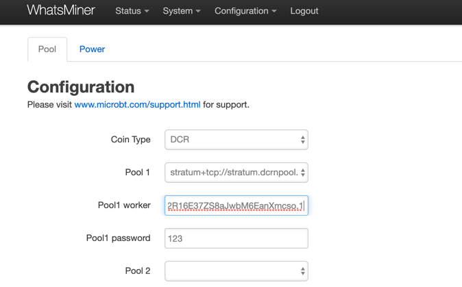
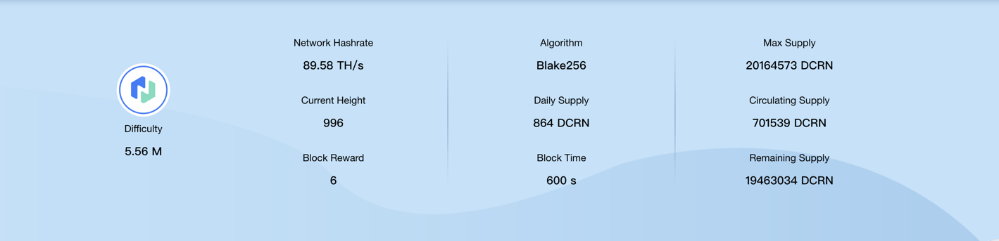

# DCRN Proof of Work

**The mechanism used by miners to show that they have contributed computational power in order to create a new block. Miners will repeatedly create a hash of the block header until they find a hash equal to or below the current difficulty. Once shared with the network, this hash can easily be validated, thus demonstrating proof of the miners’ work.**

DCRN Proof of Work miners play a similar role for Decred-Next as they do for Bitcoin,  with Decred-Next-Next they will receive 60% of the block reward.

---

## DCRN POW Mining
Proof-of-work mining, more commonly referred to as PoW mining, is the activity of committing your computer’s hardware and resources to process network transactions and build the blocks that make up the Decred-Next blockchain.

Each time a valid block is created by a miner, the miner receives the fees from all of the transactions included in the block, as well as a block reward (newly created DCRN).

The block reward reduces by a factor of 100/101 every 6,144 blocks (approximately 21.33 days). 

When proof-of-stake tickets are called to vote on a block, they have the ability to the strip the reward from the miner of the previous block. This power may be used if the miner has constructed a block contrary to the best interests of the network. For example, an empty block when there are transactions waiting to be processed in the mempool.

---

## Purchasing Specialized Hardware (ASIC)
ASIC are the machines used to mine the most popular cryptocurrencies and can only be used for mining a single algorithm.

Here is a selection of the Decred-Next ASIC miners which are available on the market today:

| Miner            | Hashrate | Power Consumption (Watts) | Unit Power (W/Th) |
| ---------------- | :------: | :-----------------------: | :---------------: |
| StrongU STU-U1++ | 52 TH/s  |          2,100 W          |      40 W/Th      |
| Whatsminer D1    | 48 TH/s  |          2,200 W          |      46 W/Th      |
| Antminer DR5     | 35 TH/s  |          1,610 W          |      46 W/Th      |

You can either buy direct from the manufacturers on their official website:

*   [Whatsminer](https://www.whatsminer.com/?locale=en)
*   [Bitmain](https://www.bitmain.com/)
*   [StrongU](https://strongu.com.cn/?lang=en-us)

---

## Hosting Your ASIC

When mining first started on CPU and GPU’s mining at home was very feasible. But as mining has become more competitive and industrialized, ASICs have taken over the network. For most people hosting an ASIC at home is not an option given the noise & power draw. That is why many miners choose to send their ASICs to a mining colocation. The hosting company charges a “hosting fee” in return for providing the ASIC electricity and an environment to run. Different models such as profit-sharing are available for larger miners.

Over the past few years many hosting companies have become available in North America and can be found in this [database](https://hashrateindex.com/farms). This database contains some of the top facilities like Blockware, Compute North, Core Scientific, Frontier, Box Miner, and many more.

Please make sure to do your own research before making any decision on engaging a colocation business.

---

## Setting up your ASIC

**Powering up the Miner**

Connect your machine to the power outlet via the built-in PSU. Then connect your miner to your internet-connected router or switch using a standard network cable. You are now ready to power up your miner.

**Scanning for Devices**

To get started, use a scanning tool like [AngryIP](https://angryip.org/) or [Locator](https://minerstat.com/software/locator) to scan every device on your local network and see its IP address. After you have identified your miner’s IP address, you are ready to proceed with Configuration.

**Configuration**

Enter the local network IP address of your miner in the URL bar of any web browser. A dashboard similar to the one shown below will pop up. We are setting up a Whatsminer D1, but the process is similar for other ASICs.

---

## DCRN Pool Mining

When you mine in a pool, your hashrate is combined with all the other pool miners’ hashrates to look for the correct solution for a block. You will receive a reward based on the amount of work your miner performs in the pool. Most mining pools pay on a pay-per-share method meaning that miners earn a steady amount of Decred-Next.

---

## Choosing and Configuring a Mining Pool

To finish the configuration, you will need to choose a mining pool. You can consider payout method ([PPS vs PPLNS](https://www.hashrateindex.com/blog/pps-fpps-pplns-pps_plus)), pool fee, geographic location of the pool, ping time to the server, user interface, statistics/data, customer support, community channels and more. Mining pools all work more or less the same but you may wish to sign up at multiple pools and see which one suits you the best.

Currently, DCRNPool support Decred-Next, and there will be more in the future
*   **[DCRNPool](https://DCRNPool.com)**

In this guide, we will set up an ASIC with [DCRNPool](https://dcrnpool.com).

**Completing Configuration**

After logging into the management backstage of miner, click on the Miner Configuration-General Settings page to modify the mining parameters.
*   URL: `stratum+tcp://stratum.dcrnpool.com:5740`
*   Worker: `[DCRND wallet address].Worker number`   eg: DsZvTNhA34Dx7R9mz8W5J5MwzGZa2MDmine.1
*   Password: `123` (No need to modify (default password is 123 or x)

Once you have filled out the details, click Save & Apply. Setup is now complete.

**Monitoring Results**

Visit DCRNPool official website www.dcrnpool.com and click on the top right button, enter your wallet address in the search bar and click “Search”, you can then view your hash rate and earnings.

