# MyDCRN

Last updated for MyDCRN v1.5.1
The latest version of MyDCRN can be downloaded from https://github.com/Decred-Next/binary-release/releases.

MyDCRN is a graphical user interface for dcrnwallet. When this application launches, it automatically starts its own instance of the command line tools dcrnd and dcrnwallet in the background.

* Windows
   - 1.Download the Windows installer MyDcrn-v2.0.3.exe.
   - 2.Double click the installer and follow the instructions.
   - 3.The installer adds a shortcut to MyDCRN on your desktop.

## Open and Set Up MyDCRN Guide
There are three steps 

### 1.Choose Language
Opening MyDCRN for the first time will display the following screen:
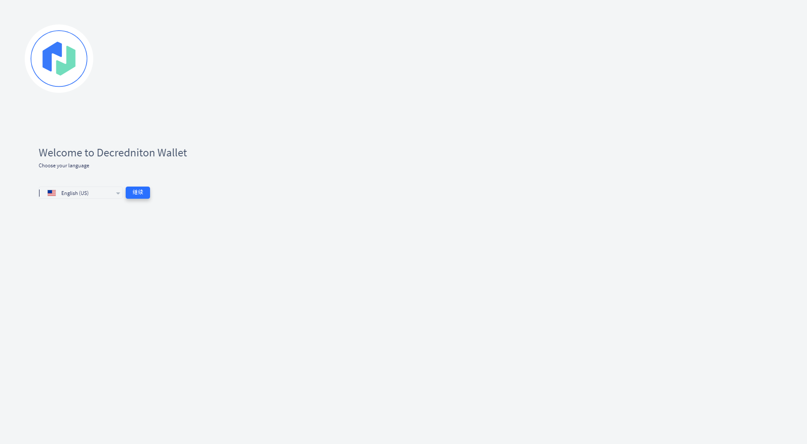

### 2.Privacy Options
You will then be offered various privacy options which allow you to restrict which external services MyDCRN will contact. The “Standard” option is recommended for most users, as this will enable all of the features in MyDCRN and provide the best user experience.
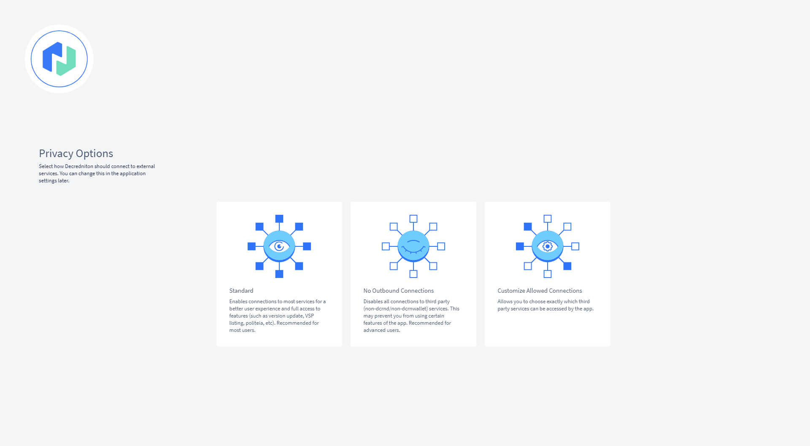

### 3.Wallet Mode
A screen will be displayed which allows you to enable SPV mode if desired.
When not in SPV mode, wallets must download all blocks in the blockchain to verify transactions (fully validating mode). SPV mode allows wallets to operate with less stringent hardware requirements and load significantly faster. SPV wallets cannot vote, but can purchase tickets and allocate voting rights to a Voting Service Provider (VSP).
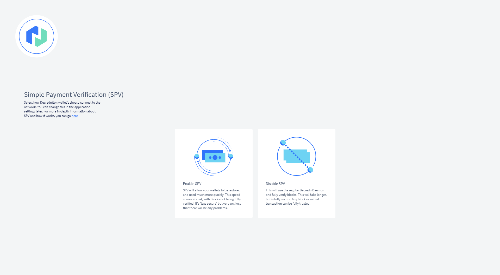

**After making your choice, a short presentation explaining Decred blockchain, wallet, keys, staking/governance, and safety tips is shown. Please read these slides carefully if you are new to Decred.**
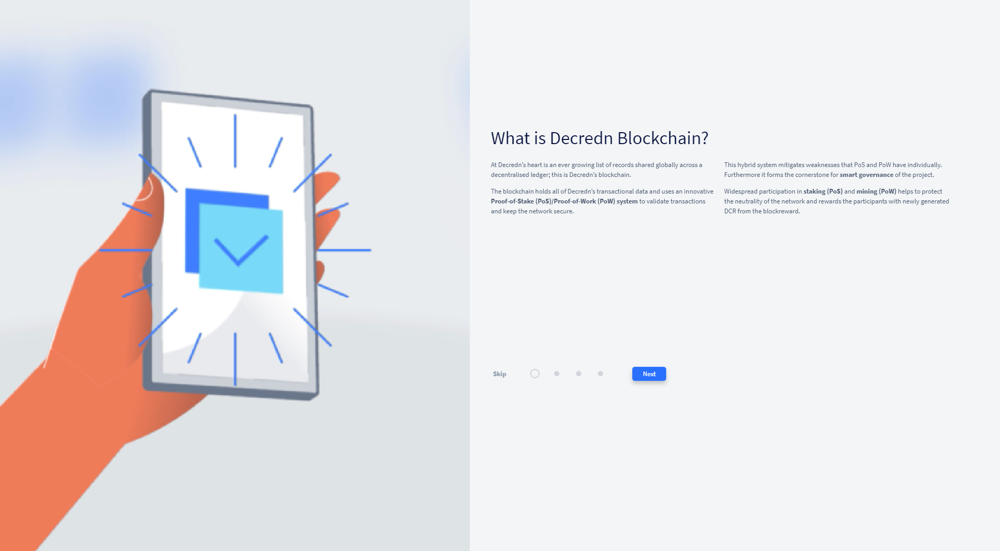

The following screen should be displayed next.
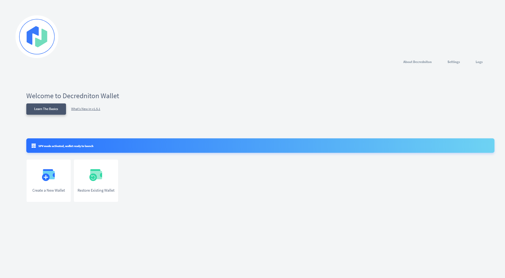

A progress bar be filled immediately. If you chose to disable SPV mode, this bar will be downloaded because downloading the blockchain is required.

### Options
You have two options:
* Create a New Wallet - Press this button if this is your first time using Decred.
* Restore Existing Wallet - Press this button if you already have a wallet seed you would like to use.

**Create a New Wallet**
1. As MyDCRN allows you to manage multiple wallets on one PC, you must give a name to your wallet so it can be identified. Enter a name and press the Continue button.
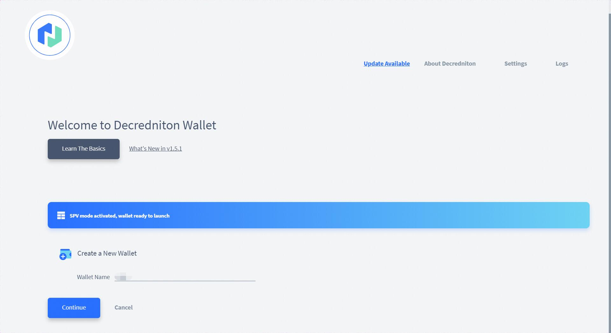
   
2. The 33 word seed for your new wallet is displayed on the screen (obscured in the below image). **Record the seed and store it somewhere safe.**
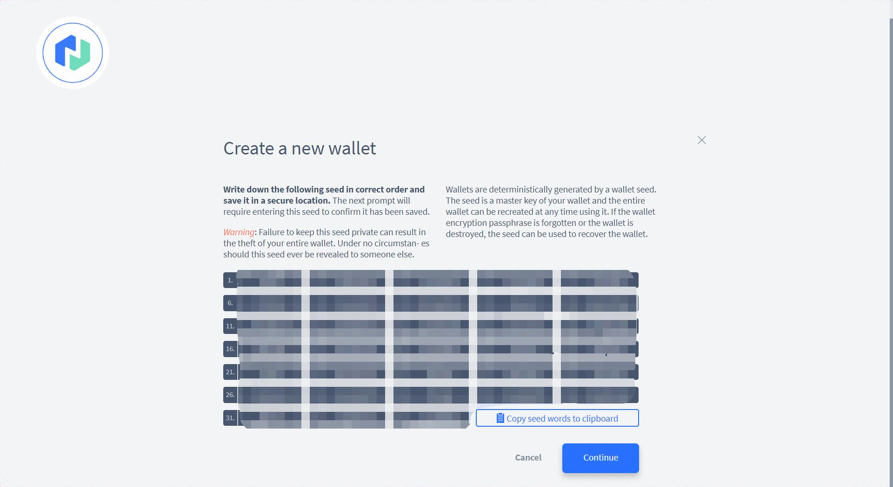

3. Press Continue and re-enter the missing words from your seed on the next screen. This is to confirm you have recorded your seed correctly.
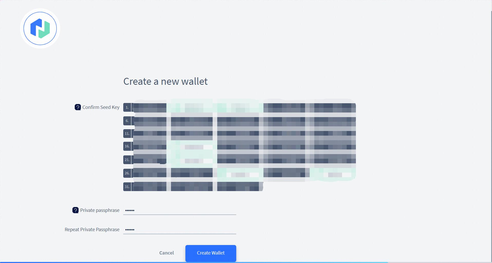

4. Create a passphrase for your wallet. This passphrase will be used to unlock your wallet when creating transactions.

5. Press Create Wallet and your wallet setup is complete.

**Restore Existing Wallet**
1. Open MyDCRN and click on Restore Existing Wallet. If MyDCRN is open and you have another wallet open, you’ll need to first go to Settings and click Close Wallet.

1. Name your wallet. As MyDCRN allows you to manage multiple wallets on one PC, you must give a name to your wallet so it can be identified.
2. Advanced users can use the “Watch only” option and enter a public key to configure a watch only wallet.
3. Enter your seed into the Confirm Seed text box.
4. Create a private passphrase for your wallet.
5. Select Create Wallet. Wait for the blockchain to be downloaded.
6. The blockchain will now be scanned for any transactions belonging to this wallet.

## Using MyDCRN Guide
### Main menu
The main menu of MyDCRN is displayed on the left side of the window, and it is used to switch between the different features MyDCRN offers. 
At the bottom of the menu is a button to rescan the blockchain.

### Overview
The overview tab gives a quick summary of your total DCRN (available and locked in tickets) and a list of recent transactions.

Graphs of your balance, ticket activity and transaction history over the last two weeks can be viewed here.
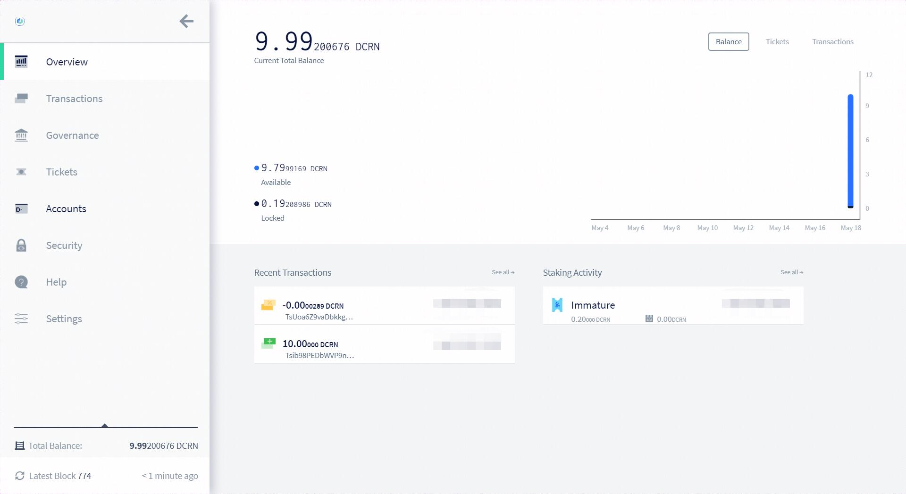

### Transactions
The transactions tab is split into four sections:
#### Send
This where you can send Decred from your wallet to another address. First you need to select which account in your wallet to send the funds from, and then enter the recipient address into the text box. Finally enter the amount of Decred you wish to send.
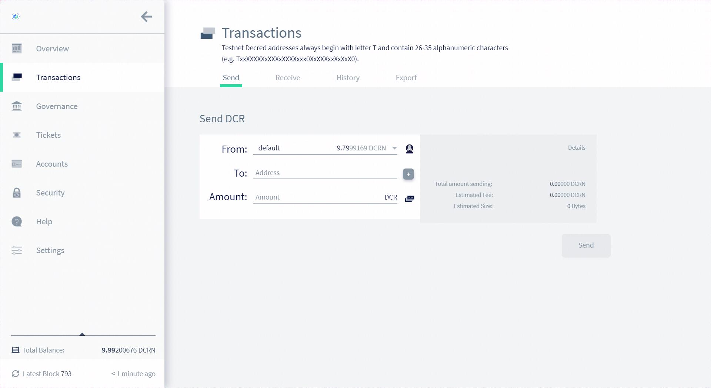

#### Receive
This is where you can generate wallet addresses to give to other people so they can send you DCRN. 
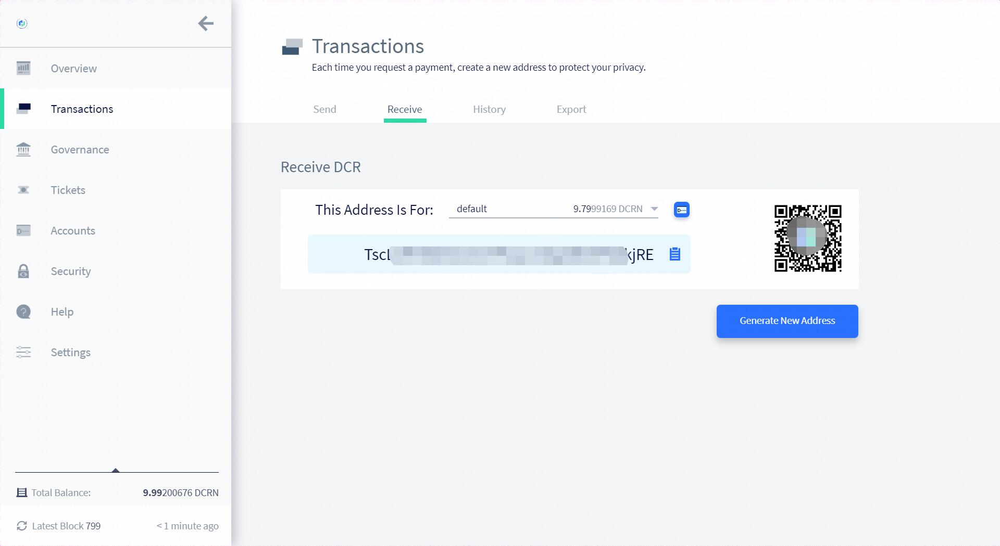

#### History
This tab shows a list of all transactions that have occurred involving this wallet. A dropdown menu allows filtering the list by transaction type: regular, tickets and votes. The transaction hash can be used with the block explorer to see more information about the transaction.
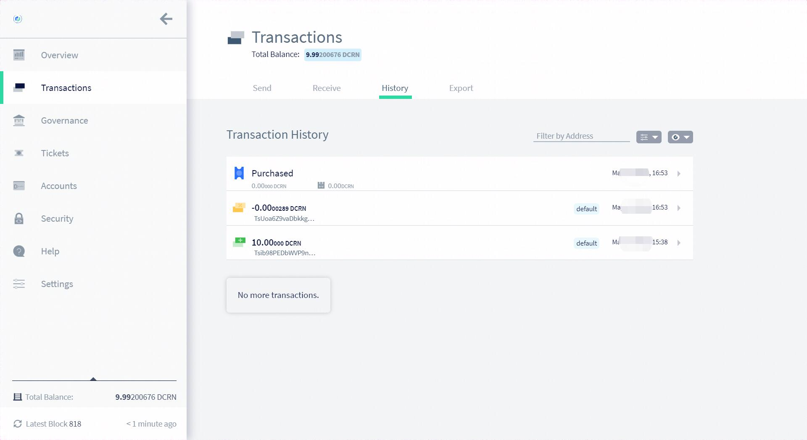

#### Export
This tab shows allows you to export your transaction history in a .csv format.
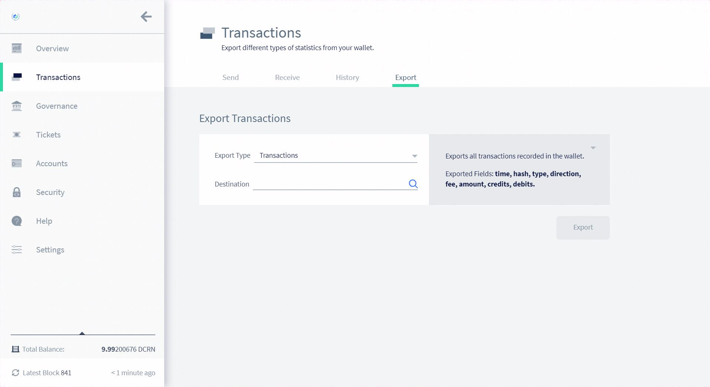

### Governance
The governance tab enables users holding tickets to have their say on Decred-next’s governance. Here you can browse and vote upon Politeia proposals, and you can set your voting preferences for on chain consensus rule votes. Your privacy settings must allow MyDCRN to contact Politeia to download proposal information.

#### Proposals
Politeia proposals can be filtered by “In Discussion”, “Voting”, “Finished Voting” and “Abandoned”. The “Create Proposal” button will open https://proposals.dcrn.xyz in your browser.
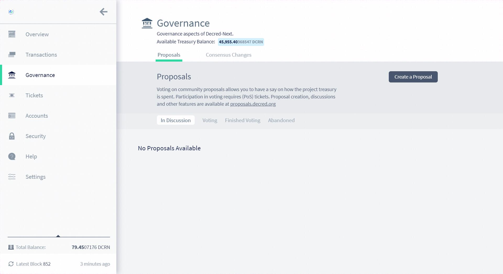

You are able to vote on proposals if the following two criteria are met:
1. There are currently proposals available open for voting
2. You owned live proof-of-stake tickets when the proposal was opened for voting

#### Consensus Changes
The Consensus Changes page shows all of the agendas which are currently up for vote on the Decred-Next blockchain. You can read the details of each agenda and choose which way you would like to vote on each issue. This setting is only used at the moment each individual ticket votes, which means that you can change your voting preferences if you change your mind about an agenda.
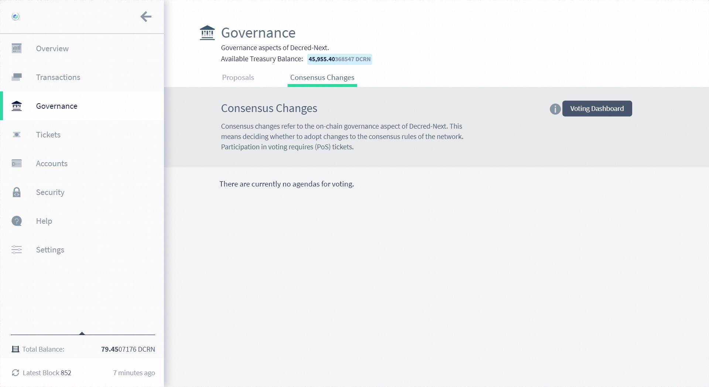

### Tickets
The staking tab is split into three sections:

#### Purchase
The total number of tickets you currently own is at the top of the page:
* Mempool Tickets - Tickets waiting to be mined by PoW miners (only 20 new tickets are mined into each block)
* Immature Tickets - Mined tickets which cannot vote until a 128 block maturing period has passed (around 10 hours)
* Live Tickets - Mature tickets eligible to be called to vote
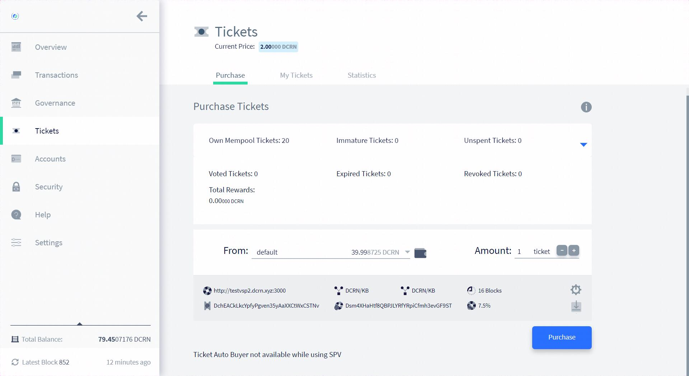

#### My Tickets
This tab shows a summary of all of your tickets which voted, expired or were missed. Filters and sorting options are available to make browsing the list easier.

#### Statistics
This page displays various statistics about all of your stake rewards, vote time or ticket activity. 

### Accounts
The accounts tab shows you the accounts in your wallet and allows you to add new ones. Accounts in Decred-Next work just like bank accounts. They allow you to keep separate records of your DCRN. 
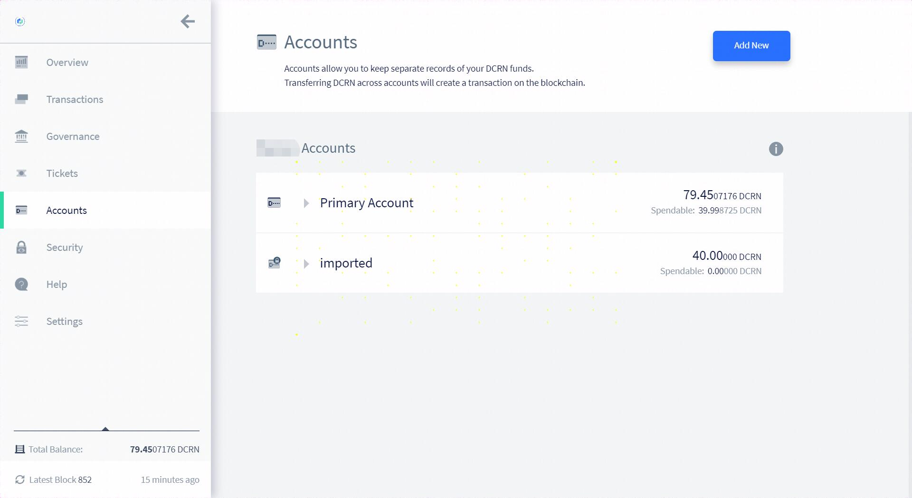

### Security
The Security tab offers two key features - the ability to sign and verify messages using your private key, and the ability to validate addresses.

#### Sign and Verify messages
Signing a message with an address’ private key allows you to prove that you are the owner of a given address to a possible counterparty.
For instance, let’s say you sent 1000 DCRN to a merchant and you have yet to receive your merchandise. You contact the merchant and explain the situation, but need a way to prove you are, in fact, the owner of the address that the funds were sent from. To do this you can generate a signature based on a message only known to you and your counterparty and the private key associated with the address. Upon receipt, the counterparty may use the Verify Message form to ensure the signature is valid.

#### Validate Addresses
A Decred address can be entered into the Validate Address text box, and Decrediton will put that address into one of three categories:
* Invalid address
* Owned address
* Address Valid, Not Owned

### Settings
The settings tab allows you to customize the units DCRN amounts are displayed in and also allows you to switch MyDCRN onto the testnet blockchain.
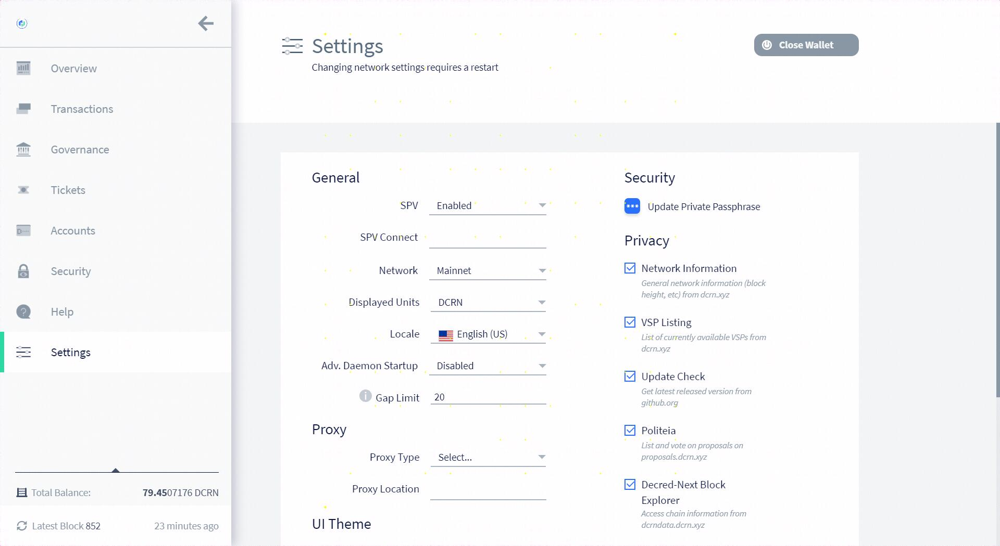
The settings tab is also where you come to change your private passphrase.

